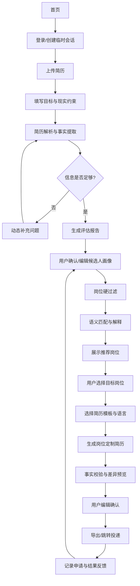
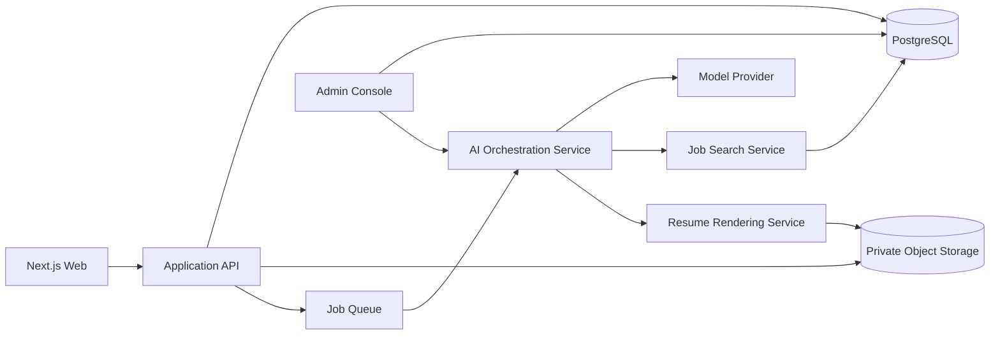

# Haigoo 个性化远程职业助手：产品与技术落地方案

> 文档目的：指导 Haigoo 将网站首页重构为“上传简历—理解自己—匹配岗位—生成定制简历—投递与反馈”的个性化远程职业入口，并明确 AI Skill、Agent、后台岗位库、简历模板与人工运营之间的边界。

---

## 1. 产品愿景与核心判断

### 1.1 产品愿景

将 Haigoo 从“用户浏览远程岗位的网站”升级为：

> **从远程开始的个性化全球职业发展助手。**

用户不再需要先理解复杂的岗位分类、远程限制和海外招聘表达，而是通过上传简历与补充现实约束，由系统帮助其完成：

- 看懂自己：识别被职位名称和流水账遮住的能力、优势、兴趣与潜力；
- 看懂远程：判断独立交付、异步沟通、时区、语言、家庭与地点约束；
- 找对岗位：从 Haigoo 后台岗位库中筛选真正可申请的机会；
- 重新表达：针对目标岗位生成基于真实证据的定制简历；
- 持续进化：根据申请、面试和结果反馈动态调整候选人画像。

### 1.2 产品核心壁垒

不是“AI 会改简历”，而是把四件事连接起来：

1. 理解一个人的真实能力与工作方式；
2. 理解全球远程岗位的地区、时区、语言和合同限制；
3. 找到可迁移且现实可申请的方向；
4. 将候选人重新表达为招聘方能够理解和验证的人。

### 1.3 首期边界

首期必须控制 Agent 自主性，采用“AI 分析 + 规则过滤 + 用户确认 + 人工可审计”的方式。

**MVP 包含：**

- PDF/DOCX 简历上传；
- 基本需求与现实约束表单；
- 简历结构化解析；
- 简历诊断、核心优势、远程适配度与方向建议；
- 最多两轮动态补充问题；
- 候选人画像确认与编辑；
- 后台岗位库匹配；
- 用户确认目标岗位；
- 每个岗位生成独立简历版本；
- 网页预览、编辑、导出、跳转申请链接；
- 申请状态记录。

**MVP 暂不包含：**

- 自动登录第三方招聘网站并代投；
- 自动发送邮件或 LinkedIn 消息；
- 未经用户确认自动修改个人事实；
- 完全自动判断工作授权、税务或跨境雇佣合规；
- 为所有行业一次性建立高质量模板。

---

## 2. 用户角色与使用场景

### 2.1 核心用户

1. 有多年工作经验但不清楚如何迁移到远程岗位的人；
2. 简历较“流水账”，无法清楚表达优势的人；
3. 有家庭、地点、时区或工作时间限制的人；
4. 正在转型，希望先获得兼职、合同制或项目制收入的人；
5. 有国际化或跨境经验，但不了解海外招聘表达的人；
6. 已有目标岗位，需要针对 JD 生成定制简历的人。

### 2.2 用户要完成的操作

用户必须承担以下责任，系统不得替代：

- 上传真实且有权使用的简历；
- 选择或填写工作地点、时区、可工作时段、语言、合同偏好等信息；
- 回答系统提出的关键补充问题；
- 核对并确认候选人画像；
- 核对每份定制简历中的事实；
- 决定是否申请某个岗位；
- 在第三方网站完成最终投递，或明确授权后使用未来的代投功能；
- 反馈面试、拒绝、Offer 等结果。

### 2.3 Haigoo 人工运营角色

- **岗位运营**：审核岗位真实性、地区限制、时区、语言、合同类型和申请有效期；
- **职业顾问/质检员**：抽查 AI 评估、处理复杂转型和高价值用户；
- **模板运营**：维护中文、英文和行业简历模板；
- **Prompt/Eval 运营**：维护样本集、评分标准和 Prompt 版本；
- **隐私与客服**：处理删除、导出、更正和投诉请求。

---

## 3. 首页与完整用户流程

### 3.1 首页结构建议

首页主 Hero 不再以岗位列表为唯一入口，而是以个性化行动为核心：

**主标题示例：**

> 上传简历，找到真正适合你的远程工作

**副标题示例：**

> 不只看职位和年限。Haigoo 会结合你的经验、优势、可工作时间和地点限制，分析可迁移方向，匹配国内可申的远程岗位，并为目标岗位生成定制简历。

**主 CTA：**

- 上传简历，开始评估

**次 CTA：**

- 暂时没有简历，先填写经历
- 浏览远程岗位

首页继续保留岗位与内容模块，但它们成为个性化结果之外的辅助入口。

### 3.2 用户流程状态机



### 3.3 分步页面

#### Step 1：上传简历

支持：

- PDF；
- DOCX；
- 后续支持 LinkedIn PDF、纯文本与手动填写。

界面必须说明：

- 文件用途；
- 保存时长；
- 是否会发送给第三方模型；
- 用户可以随时删除；
- 不建议上传身份证、银行卡、家庭住址等无关信息。

#### Step 2：基本选项与背景补充

必填项应尽量少，但必须覆盖远程硬约束：

- 当前所在地与时区；
- 希望全职、兼职、合同制、自由职业或项目制；
- 每周可工作小时；
- 可稳定工作的时间段；
- 是否可以参加晚间会议；
- 可接受的语言环境；
- 目标收入区间，可选；
- 是否希望继续原行业或接受转型；
- 最想保留的职业资产；
- 当前最担心的问题。

#### Step 3：解析与评估进度

显示真实阶段，而不是无意义加载动画：

1. 正在读取工作经历；
2. 正在区分事实与自我评价；
3. 正在识别可迁移能力；
4. 正在检查远程工作条件；
5. 正在判断是否需要补充信息。

#### Step 4：补充问题

问题必须“少而有用”。每轮最多 3 个，最多 2 轮。

问题优先级：

1. 直接影响岗位硬过滤的信息；
2. 直接影响核心能力判断的信息；
3. 直接影响成果可信度的信息；
4. 直接影响简历定制的信息。

示例：

- 这个项目由你独立负责，还是与团队共同完成？
- 你主要可以稳定工作的具体时间段是什么？
- “转化率提升 2 倍”的起点和统计周期是什么？
- 你是否能用英文参加每周固定会议？

允许用户选择：不知道、暂时跳过、稍后补充。

#### Step 5：评估报告

报告建议分为：

1. 一句话职业画像；
2. 简历当前问题；
3. 核心优势与证据；
4. 隐藏潜力与置信度；
5. 远程适配度；
6. 适合的工作形态；
7. 立即、过渡、长期岗位方向；
8. 下一步准备清单。

报告中的每项结论必须标记：

- 简历事实；
- 用户补充事实；
- 合理推断；
- 待验证。

#### Step 6：候选人画像确认

用户不应直接进入岗位匹配。先展示结构化画像并要求确认：

- 核心能力；
- 行业资产；
- 目标岗位；
- 不希望从事的工作；
- 地点、时区、语言和合同限制；
- 成果证据；
- 需要补强的能力。

每项均可编辑。修改后保留版本历史。

#### Step 7：岗位推荐

每个岗位展示“为什么推荐”和“为什么可能不适合”。

推荐卡至少包括：

- 岗位名称与公司；
- 地区与时区要求；
- 合同类型；
- 匹配度；
- 三项匹配证据；
- 两项缺口或风险；
- 推荐使用的简历版本；
- 申请截止或抓取时间；
- 岗位真实性/审核状态。

用户操作：

- 很感兴趣；
- 可以考虑；
- 不感兴趣；
- 不符合现实条件；
- 已申请；
- 隐藏类似岗位。

这些反馈必须进入画像更新和匹配评估。

#### Step 8：定制简历

用户选择 1–5 个岗位后，系统：

1. 选择合适模板；
2. 对 JD 做结构化拆解；
3. 从候选人证据库中选择最相关事实；
4. 重排经历与项目；
5. 调整 Summary、Skills 和 bullet points；
6. 生成事实差异表；
7. 运行幻觉和过度表述检查；
8. 生成网页预览；
9. 用户确认后导出。

不得直接覆盖用户原始简历。

#### Step 9：投递与反馈

MVP：

- 打开官方申请链接；
- 记录投递日期；
- 选择使用的简历版本；
- 记录申请状态；
- 设置后续提醒；
- 记录面试反馈。

自动代投应单独作为后续项目评估，不与 MVP 混在一起。

---

## 4. AI Skill 架构

Skill 是一组可复用、可测试、输出结构化数据的分析能力，不应写成一个超长 Prompt 一次完成所有工作。

### 4.1 Skill 模块

1. `resume_fact_extraction`
   - 提取公司、岗位、日期、职责、项目、成果、教育、语言、工具；
   - 区分自我评价和可验证事实；
   - 标记时间线冲突、异常年限与信息缺失。

2. `evidence_ledger_builder`
   - 建立候选人证据账本；
   - 每条能力和成果必须关联来源；
   - 记录证据强度与是否经用户确认。

3. `capability_inference`
   - 从多段经历中识别专业能力、通用业务能力、工作方式能力和领域资产；
   - 识别重复选择、主动行为、描述密度和跨经历共性；
   - 输出推断置信度。

4. `resume_diagnosis`
   - 检查定位、流水账、成果、结构、可信度、术语、篇幅、ATS 和远程表达；
   - 不直接重写。

5. `remote_readiness_assessment`
   - 独立交付；
   - 异步沟通；
   - 时间管理；
   - 数字工具；
   - 语言与跨文化；
   - 时间地点限制；
   - 工作环境与数据安全。

6. `career_path_builder`
   - 生成立即、过渡和长期三层方向；
   - 每个方向附带证据、缺口和准备成本。

7. `clarification_question_generator`
   - 只提出会改变结论的问题；
   - 最多 3 个/轮；
   - 支持选项和自由填写；
   - 记录问题为何被提出。

8. `candidate_profile_synthesis`
   - 汇总为可供岗位匹配的结构化画像；
   - 生成用户可读版本和机器版 JSON。

9. `claim_verifier`
   - 在生成简历前检查每项表述是否有证据；
   - 禁止凭空补数字、管理规模、语言水平和工作方式。

详细规则见 `specs/REMOTE_CAREER_ASSESSMENT_SKILL.md`。

### 4.2 Skill 输出原则

- 事实、推断、建议分离；
- 证据不足时明确写“待验证”；
- 不因年限长默认资深；
- 不因无正式远程经历默认不适合；
- 不使用单一总分掩盖具体限制；
- 所有岗位方向都要解释现实可行性；
- 生成简历时只能改写、选择、重排已确认事实。

---

## 5. Agent 架构

### 5.1 Orchestrator

负责状态流转，不直接承担所有推理：

- 判断下一步调用哪个 Skill；
- 读取用户与任务状态；
- 调用后台岗位和模板工具；
- 保存结构化结果；
- 处理失败重试；
- 在关键节点等待用户确认。

### 5.2 Job Retrieval Agent

只查询 Haigoo 后台数据库，不允许模型自行编造岗位。

工具能力：

- `search_jobs(filters, query)`；
- `get_job(job_id)`；
- `get_company(company_id)`；
- `get_job_eligibility(job_id)`；
- `record_job_feedback(job_id, user_id, feedback)`。

### 5.3 Eligibility Filter

先执行确定性硬过滤：

- 岗位是否有效；
- 中国或用户所在地是否可申请；
- 是否支持 Remote；
- 合同类型；
- 时区重叠；
- 语言；
- 工作授权；
- 薪资/级别硬门槛；
- 用户明确排除项。

任何硬条件不明确的岗位不能被标记为“完全符合”，而应标为“需确认”。

### 5.4 Match & Rank Agent

使用三阶段排名：

1. **规则评分**：硬条件、领域、职能、级别、语言、时区；
2. **向量召回**：候选人能力与 JD 语义相似度；
3. **LLM 重排**：基于结构化证据解释匹配、缺口和申请建议。

不得仅依赖 embedding 或让大模型直接从全库挑岗位。

建议初始评分：

```text
Final Match Score =
  35% hard eligibility
+ 25% transferable skills
+ 15% domain relevance
+ 10% seniority fit
+ 10% work-style fit
+  5% user preference
```

分数只是排序工具，前端必须展示证据与风险。

### 5.5 Resume Tailoring Agent

输入：

- 经确认的 CandidateProfile；
- EvidenceLedger；
- 目标 JD；
- 模板规则；
- 语言与地区；
- 用户选择的篇幅和风格。

步骤：

1. JD 结构化；
2. 关键词和能力要求提取；
3. 从证据库选择相关内容；
4. 生成 Resume AST；
5. Claim Verifier 校验；
6. 输出修改前后差异；
7. 模板渲染；
8. 用户编辑和确认。

### 5.6 Feedback Agent

反馈不应直接修改核心画像，而应形成建议：

- 用户持续隐藏某类岗位；
- 某类岗位获得面试；
- 某项技能频繁成为缺口；
- 某份模板效果更好；
- 招聘方反馈与画像冲突。

画像更新需要用户确认或明确的高置信度规则。

---

## 6. 技术架构建议

### 6.1 技术栈原则

Codex 首先审计现有代码库，不得为了本方案无条件替换技术栈。

若现有网站是典型 Vercel/Next.js 架构，可优先采用：

- Frontend：Next.js App Router + TypeScript；
- UI：复用现有组件与设计系统；
- Auth：复用现有登录；
- Database：PostgreSQL/Supabase；
- Object Storage：Supabase Storage、S3 或现有存储；
- Background Jobs：Inngest、Trigger.dev、队列或现有任务系统；
- AI：OpenAI Responses API 或项目已配置的模型网关；
- Validation：Zod/JSON Schema；
- Rendering：结构化 Resume AST → React/HTML → PDF，DOCX 单独适配；
- Observability：Sentry + 结构化业务日志；
- Analytics：复用现有埋点，避免记录简历原文和 PII。

### 6.2 推荐服务划分



### 6.3 为什么使用后台任务

简历解析、评估、岗位匹配和多份简历生成可能超出普通请求时限。应将流程实现为可恢复的后台任务：

- 每一步有状态；
- 支持失败重试；
- 支持幂等；
- 前端轮询或使用 SSE/WebSocket 获取进度；
- 不允许刷新页面后任务丢失。

### 6.4 AI 调用分层

- 低成本模型：结构提取、分类、关键词标准化；
- 高能力模型：核心优势推断、职业路径、复杂岗位重排、简历改写；
- 规则代码：硬过滤、日期检查、字段校验、权限、状态流转；
- Embedding：岗位召回，不用于最终解释；
- 模型输出全部通过 Schema 校验。

模型名称、推理参数和价格不得硬编码在业务逻辑中，应放入配置表或环境配置。

---

## 7. 数据模型概览

核心表建议：

- `users`
- `consent_records`
- `resume_files`
- `resume_documents`
- `resume_versions`
- `resume_facts`
- `evidence_items`
- `assessment_runs`
- `clarification_sessions`
- `clarification_answers`
- `candidate_profiles`
- `candidate_profile_versions`
- `job_posts`
- `job_requirements`
- `job_eligibility_rules`
- `job_embeddings`
- `match_runs`
- `job_matches`
- `job_feedback`
- `resume_templates`
- `tailored_resume_runs`
- `tailored_resumes`
- `applications`
- `application_events`
- `prompt_versions`
- `eval_cases`
- `eval_runs`
- `manual_review_queue`
- `audit_logs`

详细字段见 `specs/DATA_CONTRACTS_AND_APIS.md`。

### 7.1 原始文件与结构化数据分离

- 原始简历存放在私有对象存储；
- 数据库只保存对象引用、哈希、解析状态和结构化字段；
- AI 与业务日志不得包含完整简历原文；
- 联系方式默认不进入岗位匹配 Prompt；
- 用户删除后，文件、派生内容、模型文件和缓存都要进入删除流程。

---

## 8. 简历模板系统

### 8.1 内容与视觉分离

不要让模型直接生成 Word 排版。先生成统一 Resume AST：

```text
ResumeDocument
- metadata
- headline
- professionalSummary
- coreSkills[]
- experiences[]
  - company
  - title
  - location
  - dates
  - bullets[]
- projects[]
- education[]
- languages[]
- certifications[]
```

模板只负责：

- 字体、字号、留白；
- 单栏/双栏；
- 模块顺序；
- 是否显示照片；
- 页面长度；
- 中英文标点与日期格式。

### 8.2 首批模板

建议先做 4 套：

1. 全球英文 ATS 单栏模板；
2. 中文专业版单栏模板；
3. 资深项目/产品/运营模板；
4. 转型与项目制模板。

不要一开始做大量视觉模板。优先保证：

- ATS 可读；
- PDF 不乱码；
- 文本可复制；
- 一页或两页分页稳定；
- 用户能在网页中编辑；
- 导出结果与预览一致。

### 8.3 事实差异视图

每次生成后展示：

- 新增：只能是用户已确认但原简历未展示的事实；
- 改写：含义不变，仅调整表达；
- 删除：与目标岗位无关；
- 重排：提高相关性；
- 风险：表达可能过强，需要用户确认。

---

## 9. 后台运营系统

### 9.1 岗位管理

后台必须支持：

- 创建、编辑、下线岗位；
- 标注来源和最后验证时间；
- 地区与工作授权；
- 时区和会议重叠；
- 合同类型；
- 语言；
- 薪资；
- 职能、行业和级别标签；
- 国内用户是否可申请；
- 是否经过人工审核；
- 招聘链接有效性；
- 重复岗位合并。

### 9.2 模板管理

- 模板预览；
- 支持语言和岗位类型；
- 模块配置；
- 字段映射；
- 版本发布与回滚；
- 使用数据与成功反馈。

### 9.3 AI 运营

- Prompt 版本；
- 模型配置；
- 失败率和成本；
- 人工纠错；
- 样本回放；
- 评估指标；
- 特定行业规则；
- 高风险输出拦截。

### 9.4 人工审核队列

触发条件示例：

- 工作年限或日期冲突；
- 简历解析置信度低；
- AI 推断与用户修改差异大；
- 高级岗位但缺少成果证据；
- 岗位地区限制不明确；
- 用户投诉结果不准确；
- 一次生成大量简历；
- 涉及受监管行业或敏感数据。

---

## 10. 隐私、安全与合规

### 10.1 用户授权

上传前提供清晰同意：

- 处理目的；
- 使用的第三方服务类型；
- 保存时长；
- 用户删除权；
- 是否用于产品质量评估；
- 匿名化后是否可进入评估样本，默认关闭或单独授权。

### 10.2 数据最小化

- 年龄、婚姻、照片、身份证、详细家庭信息默认不进入全球简历；
- 匹配时不发送姓名、电话、邮箱；
- 日志中只使用内部 ID；
- 支持在上传时提示用户移除无关敏感信息；
- 管理后台实行最小权限访问。

### 10.3 保留与删除

建议提供：

- 原始简历保留期限配置；
- 派生文件保留期限；
- 一键删除全部职业数据；
- 删除任务状态；
- 模型服务端文件删除或过期策略；
- 审计日志不保留简历正文。

### 10.4 安全

- 私有 Bucket；
- 服务端签名 URL；
- 文件类型和大小验证；
- 病毒扫描；
- Rate limit；
- 防止 Prompt Injection：简历和 JD 作为不可信内容，不能覆盖系统指令；
- 输出 HTML 清洗；
- 管理端 RBAC；
- API 密钥只在服务端；
- 不在浏览器调用模型 API。

---

## 11. 质量评估与防幻觉

### 11.1 Golden Set

上线前由人工准备至少 30–50 份匿名化样本，覆盖：

- 资深传统行业；
- 互联网与跨境；
- 工作空档；
- 全职带娃；
- 转型；
- 海外 Base；
- 英文简历；
- 流水账简历；
- 成果不足；
- 多份重叠经历。

每份样本包含人工标准：

- 核心优势；
- 远程限制；
- 可行岗位；
- 不可行岗位；
- 必须追问的问题；
- 禁止编造的内容。

### 11.2 评分维度

- 事实准确性；
- 证据可追溯；
- 洞察质量；
- 远程现实性；
- 岗位推荐准确性；
- 补充问题价值；
- 简历表达质量；
- 幻觉率；
- 用户修改率；
- 人工审核通过率。

### 11.3 生成前后校验

每份定制简历必须通过：

1. Schema 校验；
2. 日期一致性；
3. 公司/岗位一致性；
4. 数字与 EvidenceLedger 对照；
5. 语言等级不过度表述；
6. 禁止新增未确认工具；
7. 禁止将团队成果改写为个人独立成果；
8. 禁止因 JD 关键词而虚构经历。

---

## 12. 产品指标

### 12.1 漏斗指标

- 首页 → 上传率；
- 上传 → 完成基本信息率；
- 解析成功率；
- 补充问题完成率；
- 画像确认率；
- 推荐岗位点击率；
- 岗位收藏/选择率；
- 定制简历生成率；
- 简历确认率；
- 申请跳转率；
- 面试率；
- Offer 率。

### 12.2 质量指标

- 用户对画像的字段修改数；
- 用户对简历事实的纠正数；
- 硬条件误推荐率；
- 过期岗位率；
- 幻觉/过度表述率；
- 人工复核不通过率；
- 每个成功申请的 AI 成本；
- 首次获得价值时间。

### 12.3 用户价值指标

- 用户是否更清楚自己的方向；
- 是否减少无效岗位浏览；
- 是否生成至少一份可用简历；
- 是否获得更多面试；
- 是否持续回访更新画像。

---

## 13. 分阶段实施

### Phase 0：代码库审计与产品基础

Codex：

- 阅读项目结构、数据库、认证、岗位表、文件上传、支付和 UI；
- 输出差异分析；
- 补充 `AGENTS.md`；
- 新增 Feature Flag；
- 确认数据迁移策略；
- 不修改线上首页主流程。

人工：

- 确认 MVP 目标用户；
- 提供现有岗位字段说明；
- 提供 10–20 份匿名简历样本；
- 确认隐私政策和文件保留期限。

验收：

- 架构设计通过；
- 可本地运行；
- 测试与迁移方案清楚。

### Phase 1：上传、解析、评估 MVP

Codex：

- 新建独立路由；
- 上传与私有存储；
- 基础信息表单；
- 后台任务；
- 简历事实提取；
- 评估报告；
- 画像确认；
- 管理端可查看任务和错误。

人工：

- 审核评估 Prompt；
- 标注样本；
- 设定人工审核规则。

验收：

- 10 类简历可解析；
- 刷新后任务可恢复；
- 无事实新增；
- 用户可删除数据。

### Phase 2：动态追问与岗位匹配

Codex：

- 信息缺口检测；
- 追问流程；
- CandidateProfile 版本化；
- 岗位硬过滤；
- embedding 召回；
- LLM 重排与解释；
- 用户反馈。

人工：

- 完善岗位地区、时区和语言字段；
- 抽查前 100 次推荐；
- 调整权重和排除规则。

验收：

- 不推荐明确不可申请岗位；
- 每条推荐可解释；
- 用户反馈能影响后续结果。

### Phase 3：定制简历与导出

Codex：

- Resume AST；
- 4 套模板；
- JD 定制；
- Claim Verifier；
- 差异视图；
- 网页编辑；
- PDF 导出；
- 后续再做 DOCX。

人工：

- 提供模板视觉稿和范文；
- 审核行业用语；
- 抽查生成结果。

验收：

- PDF 可复制且 ATS 友好；
- 无虚构；
- 预览与导出一致；
- 每个岗位生成独立版本。

### Phase 4：申请跟踪与闭环

Codex：

- 申请记录；
- 状态更新；
- 提醒；
- 结果反馈；
- 简历版本效果统计；
- 画像更新建议。

人工：

- 设计反馈问卷；
- 处理高价值用户；
- 评估是否引入邮件或授权代投。

---

## 14. 需要用户/团队进一步决定的事项

Codex 可以先以配置或占位实现，但以下事项最终由人决定：

1. 当前网站真实技术栈和数据库；
2. 模型供应商与成本预算；
3. 原始简历和派生文件保留期限；
4. 是否允许匿名样本用于评估；
5. 免费额度、会员权益和计费节点；
6. 一次最多推荐多少岗位；
7. 一次最多生成多少份定制简历；
8. 是否提供人工职业顾问复核；
9. 首批重点行业和岗位；
10. PDF/DOCX 导出的优先级；
11. 是否允许未登录用户试用；
12. 岗位库中地区和时区字段的完整度；
13. 第三方申请链接失效检查频率；
14. 是否与现有会员权限和支付体系联动。

---

## 15. 推荐的 MVP 商业化入口

可考虑：

- 免费：一次基础评估 + 少量方向建议；
- 入门服务：完整评估 + 画像确认 + 若干岗位推荐；
- 会员：持续岗位匹配 + 定制简历额度；
- 咨询升级：人工深度访谈和职业路径；
- 企业合作：候选人授权后进入精选人才池。

任何收费节点都应发生在用户已经看到部分真实价值之后，不建议上传后立即付费才能看到任何内容。

---

## 16. 最终验收定义

第一版产品成功，不以“AI 能输出一篇长报告”为标准，而以以下条件为准：

- 用户能在 10 分钟内完成上传和基础信息；
- 评估内容能引用其真实经历而不是泛泛而谈；
- 系统能指出至少一个此前简历没有表达清楚的优势；
- 推荐岗位符合用户地点、时区和工作形态；
- 用户可以理解每个岗位为什么适合或不适合；
- 每份定制简历都能追溯到候选人确认过的事实；
- 用户可以编辑、导出、删除；
- 团队可以在后台审计、纠错和迭代。
