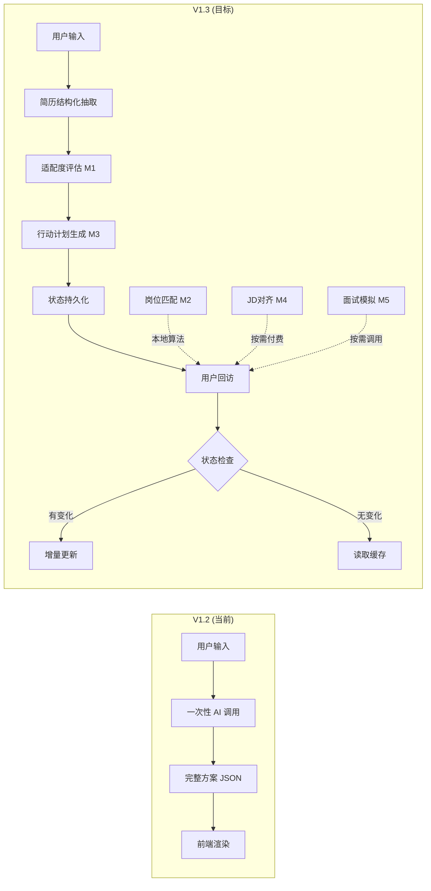

# Copilot V1.3 技术方案：从「文档生成器」到「状态驱动型求职操作系统」

## 一、现状分析与差距识别

### 现有能力（已验证可用）

| 能力 | 当前实现 | 所在文件 |
|------|----------|----------|
| 百炼 API 调用 | [callBailianAPIWithModel()](file:///Users/caitlinyct/Haigoo_Admin/Haigoo_assistant/lib/api-handlers/copilot.js#493-548) 支持 qwen-plus / qwen-max 双模型切换 | [copilot.js](file:///Users/caitlinyct/Haigoo_Admin/Haigoo_assistant/lib/api-handlers/copilot.js#L493-L547) |
| 权限分层 | guest / free (一次试用) / member (无限制) | [copilot.js](file:///Users/caitlinyct/Haigoo_Admin/Haigoo_assistant/lib/api-handlers/copilot.js#L65-L112) |
| 岗位关键词匹配 | [fetchCandidateJobs()](file:///Users/caitlinyct/Haigoo_Admin/Haigoo_assistant/lib/api-handlers/copilot.js#184-234) → ILIKE 搜索 + Jaccard 相似度排序 | [copilot.js](file:///Users/caitlinyct/Haigoo_Admin/Haigoo_assistant/lib/api-handlers/copilot.js#L184-L261) |
| 简历文本提取 | [getResumes()](file:///Users/caitlinyct/Haigoo_Admin/Haigoo_assistant/server-utils/resume-storage.js#9-64) → `contentText` / `parseResult.text` | [resume-storage.js](file:///Users/caitlinyct/Haigoo_Admin/Haigoo_assistant/server-utils/resume-storage.js) |
| Session 持久化 | `copilot_sessions` 表（goal / timeline / background / plan_data） | [neon-ddl.sql](file:///Users/caitlinyct/Haigoo_Admin/Haigoo_assistant/server-utils/dal/neon-ddl.sql#L47-L56) |
| 岗位分类体系 | `JOB_KEYWORDS` → [classifyJob()](file:///Users/caitlinyct/Haigoo_Admin/Haigoo_assistant/lib/services/classification-service.js#200-221) / `CATEGORY_REVERSE_MAP` | [classification-service.js](file:///Users/caitlinyct/Haigoo_Admin/Haigoo_assistant/lib/services/classification-service.js) |
| 岗位结构化字段 | `jobs` 表已有 title / category / experience_level / salary / location / job_type / description | DB 已有 |

### PRD 要求 vs 现状差距

| PRD 模块 | 差距 | 改造程度 |
|----------|------|----------|
| M1-远程适配度评估 | 当前 `resumeEval.score` 已存在但不够结构化（缺少 gaps/improvements 的 reason 字段）| 🟡 Prompt 重构 |
| M2-动态岗位匹配 | 已有 Jaccard 匹配，但每次都重新查 DB，**无缓存**；匹配结果未持久化 | 🟡 加缓存层 |
| M3-行动推进系统 | 当前只输出一次性 milestones，**无任务状态跟踪** | 🔴 新增表+API |
| M4-简历JD对齐 | 当前无结构化简历抽取，无 JD 对齐功能 | 🔴 新增模块 |
| M5-面试准备 | 当前 `interviewPrep` 是一次性输出，**无按需模拟** | 🟡 增加独立 API |
| 状态系统 | **完全不存在**，每次进入都重新读最新 session | 🔴 核心新增 |

---

## 二、整体架构设计

### 架构演进



### API 路由设计

> [!IMPORTANT]
> 所有新 API 均挂载在 `/api/copilot` 下，通过 `action` 参数路由，**不新增 Vercel Serverless 函数文件**，避免冷启动成本。

| Action | 方法 | 描述 | 模型 | 会员等级 |
|--------|------|------|------|----------|
| [generate](file:///Users/caitlinyct/Haigoo_Admin/Haigoo_assistant/lib/api-handlers/copilot.js#265-492) | POST | 现有主入口（保留，微调 Prompt） | plus/max | all |
| `assess` | POST | M1: 远程适配度评估 | plus | all |
| `match-jobs` | POST | M2: 动态岗位匹配（本地算法） | **无模型** | all |
| `create-plan` | POST | M3: 生成阶段计划 | plus | member |
| `update-progress` | POST | M3: 更新任务进度 + 触发增量建议 | plus | member |
| `align-resume` | POST | M4: 简历 vs JD 对齐分析 | max | member |
| `extract-resume` | POST | M2前置: 简历结构化抽取 | plus | all |
| `interview-prep` | POST | M5: 面试准备规划 | plus | member |
| `mock-interview` | POST | M5: 模拟面试问答 | max | member |
| `get-state` | GET | 读取用户完整状态 | **无模型** | all |

---

## 三、数据库变更方案

### 新增表 1：`copilot_user_state`（核心状态表）

```sql
CREATE TABLE IF NOT EXISTS copilot_user_state (
    user_id VARCHAR(255) PRIMARY KEY REFERENCES users(user_id) ON DELETE CASCADE,
    
    -- 简历结构化数据（M1/M2/M4共用）
    resume_structured JSONB,          -- 结构化简历 { career_level, skills, tools, ... }
    resume_version INT DEFAULT 0,     -- 简历版本号，每次上传/解析递增
    
    -- 适配度评估结果（M1）
    readiness_data JSONB,             -- { score, strengths, gaps, improvements, ... }
    readiness_generated_at TIMESTAMPTZ,
    
    -- 当前阶段（M3）
    current_phase VARCHAR(50) DEFAULT 'not_started',  -- not_started / resume / apply / interview / offer
    plan_data JSONB,                  -- 阶段计划 { phases: [...] }
    
    -- 进度统计
    applied_count INT DEFAULT 0,
    interview_count INT DEFAULT 0,
    
    -- 时间追踪
    created_at TIMESTAMPTZ DEFAULT NOW(),
    updated_at TIMESTAMPTZ DEFAULT NOW()
);
```

### 新增表 2：`copilot_tasks`（任务跟踪表）

```sql
CREATE TABLE IF NOT EXISTS copilot_tasks (
    id SERIAL PRIMARY KEY,
    user_id VARCHAR(255) REFERENCES users(user_id) ON DELETE CASCADE,
    phase VARCHAR(50) NOT NULL,       -- resume / apply / network / interview / english
    task_name VARCHAR(255) NOT NULL,
    priority VARCHAR(10) DEFAULT 'medium', -- high / medium / low
    status VARCHAR(20) DEFAULT 'pending',  -- pending / in_progress / completed / skipped
    completed_at TIMESTAMPTZ,
    created_at TIMESTAMPTZ DEFAULT NOW()
);

CREATE INDEX IF NOT EXISTS idx_copilot_tasks_user ON copilot_tasks(user_id, status);
```

### 新增表 3：`copilot_job_matches`（匹配缓存表）

```sql
CREATE TABLE IF NOT EXISTS copilot_job_matches (
    id SERIAL PRIMARY KEY,
    user_id VARCHAR(255) REFERENCES users(user_id) ON DELETE CASCADE,
    job_id VARCHAR(255),
    match_score INT,                  -- 0-100
    match_reason TEXT,                -- 可选：AI 生成的匹配理由
    created_at TIMESTAMPTZ DEFAULT NOW()
);

CREATE INDEX IF NOT EXISTS idx_copilot_job_matches_user ON copilot_job_matches(user_id, match_score DESC);
```

### 现有表变更

```sql
-- copilot_sessions: 增加 module 字段区分不同模块的调用记录
ALTER TABLE copilot_sessions ADD COLUMN IF NOT EXISTS module VARCHAR(30) DEFAULT 'generate';
-- 可选值: generate / assess / align / interview / mock / progress
```

> [!NOTE]
> `copilot_sessions` 保留作为 **调用日志表**，记录每次 AI 调用的输入/输出/模型/token消耗，用于计费和审计。`copilot_user_state` 作为**单行状态表**（每用户一行），用于快速读取状态，避免每次查询 sessions 的最新记录。

---

## 四、各模块详细设计

### M1: 远程适配度评估

#### 触发时机
1. 用户**首次**进入 Copilot 页面（无 `readiness_data`）
2. 用户上传新简历（`resume_version` 变化）
3. 用户手动点击「重新评估」

#### 实现逻辑

```
前端请求 → POST /api/copilot { action: 'assess' }
           ↓
后端检查 copilot_user_state.readiness_generated_at
   ├── 若 < 7天 且 resume_version 未变 → 直接返回缓存
   └── 否则 → 调用 qwen-plus 生成
           ↓
Prompt 入参: goal + timeline + background + resume_structured（如有）
           ↓
输出 JSON → 写入 copilot_user_state.readiness_data
           ↓
返回前端 → 渲染雷达图 + 差距卡片
```

#### Prompt 优化（对比 PRD，适配现有字段）

System Prompt 沿用 PRD 建议的**纯 JSON 输出约束**。User Prompt 复用现有 `background` 对象的字段名（`education / industry / seniority / language`），避免前端改造。

#### 模型与 Token 预算
- **模型**: qwen-plus
- **预估 Token**: 入参 ~300 + 出参 ~500 = **~800 tokens/次**
- **调用频率**: 极低（每用户仅在简历变更时）

---

### M2: 动态岗位匹配引擎

#### 核心变化：不再每次调 AI

```
前端请求 → POST /api/copilot { action: 'match-jobs' }
           ↓
后端读取 copilot_user_state.resume_structured
   ├── 若无 → 先触发 extract-resume
   └── 有 → 提取 skills + roles + industries 为关键词
           ↓
复用现有 fetchCandidateJobs() + calculateSimilarity()
但改进为：
  1. 搜索池扩大到 60 条（从当前 40）
  2. 匹配维度增加 skills 关键词权重
  3. 结果写入 copilot_job_matches 缓存表
           ↓
返回 Top 20 匹配岗位（含 score + 基本信息）
```

#### 匹配算法升级（保持零模型调用）

现有 [calculateSimilarity](file:///Users/caitlinyct/Haigoo_Admin/Haigoo_assistant/lib/services/job-sync-service.js#7-42) 是纯 Jaccard，对中文分词不够敏感。升级方案：

```javascript
function enhancedSimilarity(userProfile, jobText) {
  const jaccard = calculateSimilarity(userProfile, jobText);  // 复用现有
  
  // 加权：技能关键词命中加分
  const userSkills = userProfile.skills || [];
  const jobLower = jobText.toLowerCase();
  let skillHits = 0;
  for (const skill of userSkills) {
    if (jobLower.includes(skill.toLowerCase())) skillHits++;
  }
  const skillScore = userSkills.length > 0 ? skillHits / userSkills.length : 0;
  
  // 综合得分：Jaccard 60% + 技能命中 40%
  return jaccard * 0.6 + skillScore * 0.4;
}
```

#### 缓存策略
- 匹配结果写入 `copilot_job_matches`，有效期 24 小时
- 若 `resume_version` 变更，自动失效并重新计算
- 新岗位入库时（爬虫同步后），标记所有缓存为 stale

---

### M3: 行动推进系统

#### 两阶段实现

**阶段 A: 计划生成**

```
POST /api/copilot { action: 'create-plan' }
  → 入参: readiness_data.gaps + goal + timeline
  → qwen-plus 生成分阶段计划
  → 写入 copilot_user_state.plan_data + 批量插入 copilot_tasks
```

**阶段 B: 进度推进**

```
POST /api/copilot { action: 'update-progress', taskId, status: 'completed' }
  → 更新 copilot_tasks 状态
  → 检查当前 phase 完成度
  → 若 phase 完成率 > 80%：
      调用 qwen-plus → 生成下一阶段建议
      写入 copilot_sessions (module: 'progress')
  → 返回 { next_focus, suggestions, motivation }
```

#### 模型与 Token 预算
- **计划生成**: qwen-plus, ~600 tokens/次, 仅生成一次
- **进度更新**: qwen-plus, ~300 tokens/次, 仅在阶段转换时调用
- **任务标记**: 零模型调用（纯 DB UPDATE）

---

### M4: 简历与 JD 对齐引擎（会员核心付费功能）

#### 前置依赖
- `resume_structured`（由 `extract-resume` 生成）
- 岗位 JD 已有字段（`jobs` 表的 category / experience_level / description）

#### 实现逻辑

```
POST /api/copilot { action: 'align-resume', jobIds: [最多5个] }
  → 权限检查: 仅 member
  → 从 DB 读取 5 个岗位的结构化信息
  → 从 copilot_user_state 读取 resume_structured
  → 调用 qwen-max（Token 预算：入参 ~1200 + 出参 ~1500 = ~2700）
  → 输出: match_score / missing_keywords / rewrite_suggestions / cover_letter / email_template
  → 写入 copilot_sessions (module: 'align')
```

#### Token 优化策略（采纳 PRD 建议）
1. **JD 预处理**: 不传完整 description，仅传 `{ title, category, experience_level, salary, requirements摘要(前500字) }`
2. **简历预处理**: 使用 `resume_structured` 而非原文
3. **分两次调用**（可选优化，V1.3 暂不实现，留作 V1.4）

---

### M5: 面试与英语提升

#### 两个子 API

**规划版（低频）**:
```
POST /api/copilot { action: 'interview-prep' }
  → qwen-plus, ~500 tokens
  → 输出结构化面试主题 + 常见问题 + 回答框架
  → 缓存到 copilot_user_state（附加字段或 sessions）
```

**模拟问答版（按需）**:
```
POST /api/copilot { action: 'mock-interview', jobId }
  → qwen-max, ~800 tokens
  → 根据特定岗位 JD + 用户简历生成 3 道模拟题
  → 写入 copilot_sessions (module: 'mock')
```

---

## 五、前端改造方案

### 页面结构

将现有的 [CopilotSection](file:///Users/caitlinyct/Haigoo_Admin/Haigoo_assistant/src/components/home/CopilotSection.tsx#45-652)（首页嵌入式表单）改为**独立页面** `/copilot`，采用 Tab 导航：

| Tab | 对应模块 | 组件 |
|-----|----------|------|
| 📊 适配度 | M1 | `ReadinessPanel` — 雷达图 + 差距卡片 |
| 💼 岗位匹配 | M2 | `JobMatchPanel` — Top 20 列表 + 匹配度标签 |
| 📋 行动计划 | M3 | `ActionPlanPanel` — 阶段面板 + 任务勾选 |
| 📄 简历对齐 | M4 | `ResumeAlignPanel` — 选择岗位 → 对齐报告 |
| 🎤 面试准备 | M5 | `InterviewPanel` — 准备清单 + 模拟问答按钮 |

### 状态管理

使用 React Context（`CopilotContext`）统一管理用户状态，进入 `/copilot` 页面时一次性拉取 `get-state`，后续各 Tab 按需触发对应 API。

---

## 六、Token 成本预估与控制

| 模块 | 模型 | 单次 Token | 调用频率 | 月均成本预估(100活跃用户) |
|------|------|-----------|----------|--------------------------|
| M1 适配度评估 | plus | ~800 | 1次/用户/月 | ¥0.8 |
| M2 岗位匹配 | **无** | 0 | 不限 | ¥0 |
| M3 计划生成 | plus | ~600 | 1次/用户 | ¥0.6 |
| M3 进度更新 | plus | ~300 | 3次/用户/月 | ¥0.9 |
| M4 简历对齐 | max | ~2700 | 2次/会员/月 | ¥10.8 (仅会员) |
| M5 面试规划 | plus | ~500 | 1次/用户/月 | ¥0.5 |
| M5 模拟问答 | max | ~800 | 3次/会员/月 | ¥4.8 (仅会员) |
| **合计** | | | | **~¥18.4/月** |

> [!TIP]
> 对比 V1.2（每次生成完整方案 2000-2800 tokens），V1.3 通过模块化 + 缓存 + 本地算法，**在功能大幅增强的同时，总 token 消耗反而降低约 40%**。

---

## 七、实施分期建议

### Phase 1（核心基础，建议优先实施）
1. 新增 DB 表（`copilot_user_state` + `copilot_tasks`）
2. 实现 `extract-resume` — 简历结构化抽取
3. 实现 `assess` — 远程适配度评估（替换现有 resumeEval）
4. 实现 `get-state` — 状态读取 API
5. 前端：`ReadinessPanel` 雷达图 + 差距卡片

### Phase 2（岗位匹配 + 行动系统）
1. 升级 [fetchCandidateJobs](file:///Users/caitlinyct/Haigoo_Admin/Haigoo_assistant/lib/api-handlers/copilot.js#184-234)，加入结构化关键词匹配
2. 实现 `create-plan` + `update-progress`
3. 新增 `copilot_job_matches` 缓存表
4. 前端：`JobMatchPanel` + `ActionPlanPanel`

### Phase 3（付费高级功能）
1. 实现 `align-resume`（会员专属）
2. 实现 `interview-prep` + `mock-interview`
3. 前端：`ResumeAlignPanel` + `InterviewPanel`

---

## 八、验证计划

### 自动化验证
- 对每个新 API 编写 curl 测试脚本，覆盖权限分层（guest / free / member）
- JSON 输出格式校验（确保 AI 返回可被 `JSON.parse()` 直接解析）

### 手动验证
- 在 Preview 环境完成全流程 E2E 测试
- 逐步灰度到生产环境

---

> [!CAUTION]
> **破坏性变更风险**: 本方案**不拆除**现有 [generate](file:///Users/caitlinyct/Haigoo_Admin/Haigoo_assistant/lib/api-handlers/copilot.js#265-492) action 和 [CopilotSection](file:///Users/caitlinyct/Haigoo_Admin/Haigoo_assistant/src/components/home/CopilotSection.tsx#45-652) 组件。新模块以增量方式添加，通过 `action` 参数路由。现有用户体验零影响，新功能在 `/copilot` 独立页面承载。
